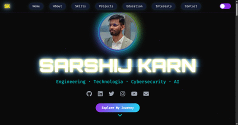

# Sarshij Karn – Modern Portfolio Website

Welcome to the portfolio website of **Sarshij Karn** – an Electronics, Communication & Information Engineering student passionate about technology, AI, embedded systems, and learning. This site is a high-performance, visually immersive personal portfolio showcasing modern web techniques.

[🌐 **Live Demo**](https://sarshijkarn.com.np/)



---

## ✨ Features

- **Immersive Video Backgrounds**: High-quality galaxy background, blackhole hero effect, and dynamic video profiles.
- **Modern UI/UX**: Fully responsive design with glassmorphism, neon effects, and smooth transitions.
- **Hardware Accelerated**: Optimized for performance on all devices using GPU acceleration techniques for 60fps playback.
- **Interactive Elements**: Glitch text effects, typing animations, and hover-triggered 3D card flips.
- **Light/Dark Mode**: Persistent theme toggle with adapted visual assets.
- **Smooth Navigation**: Scroll-spy navigation and animated section reveals.
- **Mobile First**: Optimized layouts for mobile devices, including touch-friendly menus and resized assets.
- **Accessible**: Semantic HTML and ARIA labels for better accessibility.

---

## 🚀 Quick Start

1. **Clone or Download this repo**
2. Open `index.html` in your browser

This project is _static only_ – no server-side rendering required!

> Optionally, for local development, use [Live Server extension](https://marketplace.visualstudio.com/items?itemName=ritwickdey.LiveServer) in VSCode to auto-reload changes.

---

## 🛠️ Technologies & Tools

- **HTML5 & CSS3:** Semantic markup, CSS Custom Properties (Variables), Flexbox/Grid.
- **JavaScript (Vanilla):** efficient DOM manipulation and interaction logic.
- **[GSAP](https://greensock.com/gsap/):** For high-performance, timeline-based animations.
- **FontAwesome:** For vector icons.
- **Google Fonts:** Custom typography (Orbitron, Poppins, Fira Code).
- **Video Assets:** Optimized MP4s for backgrounds and hero elements.

---

## 📂 Folder/File Structure

```
My-Website/
│
├── index.html         # Main HTML file, includes all sections and scripts
├── style.css          # Core styles, animations, variables, responsive design
├── project-icons.css  # Specific animations for project icons
├── script.js          # UI logic: animations, global state, mobile optimization
├── assets/            # Video assets, images, and documents
│    ├── galaxy.mp4       # Main background
│    ├── blackhole.mp4    # Hero section visual
│    ├── hero-video.mp4   # Personal profile video
│    └── ...
├── README.md          # This file
└── ...
```

---

## 🔍 Project Highlights

### Visual Experience

- **Video Integration**: Seamless integration of multiple video layers (background, foreground, masks) without compromising performance.
- **GPU Acceleration**: All heavy visual elements use `transform: translateZ(0)` to ensure smooth rendering on mobile devices.
- **Responsive Design**: Assets resize and reposition dynamically based on the device view (Mobile/Tablet/Desktop).

### Interaction

- **Hero Section**: Features a static/video profile option, typing text effect, and glitch title animation.
- **Cards & sections**: 3D tilt effects on hover and intersection-observer based scroll animations.

---

## 🧑‍💻 Customization

- **Videos:** Replace assets in `/assets/` and update paths in `index.html`.
- **Personal info:** Update `index.html` content sections.
- **Theme:** Adjust colors in `style.css` :root variables.
