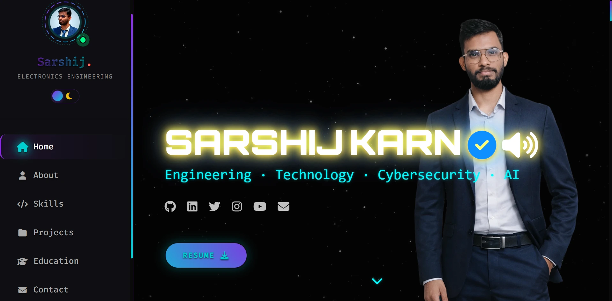
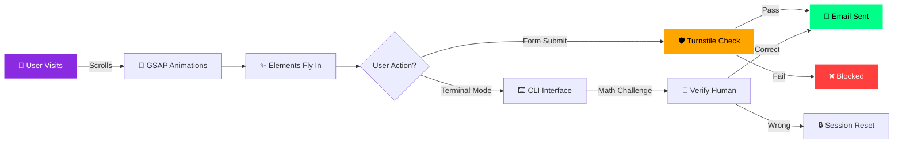
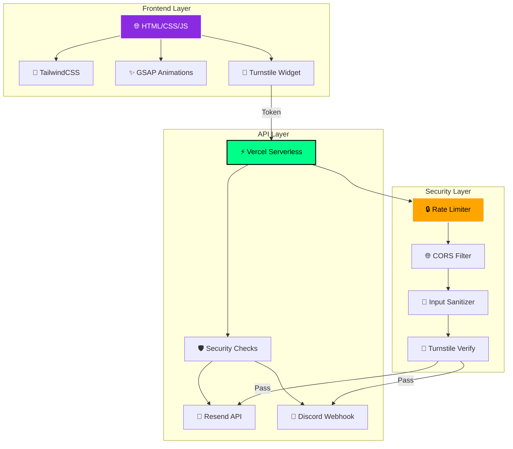
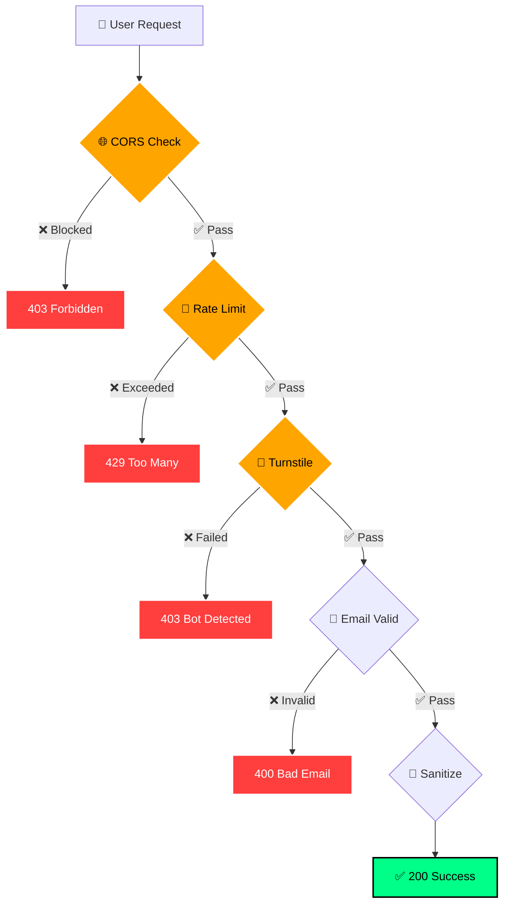

<div align="center">

<!-- HERO SECTION -->


# 🌌 NEURAL-AURA PORTFOLIO

### _Where Cyberpunk Aesthetics Meet Enterprise Security_

<p align="center">
  <a href="https://sarshijkarn.com.np"></a>
  <a href="#"></a>
  <a href="#"></a>
  <a href="#"></a>
</p>

<p align="center">
  
  
  
</p>

**A futuristic, bulletproof portfolio website featuring real-time animations, advanced security, and a cyberpunk aesthetic that screams 2026.**

[🚀 View Live](https://sarshijkarn.com.np) • [📖 Documentation](#-table-of-contents) • [🛡️ Security](#-security-architecture) • [⚡ Features](#-feature-showcase)

</div>

---

## 📑 Table of Contents

<details open>
<summary><b>Click to expand/collapse</b></summary>

- [🎬 Demo \& Preview](#-demo--preview)
- [✨ Feature Showcase](#-feature-showcase)
- [🏗️ Architecture](#-architecture)
- [🛡️ Security Architecture](#-security-architecture)
- [🚀 Quick Start](#-quick-start)
- [⚙️ Configuration](#️-configuration)
- [🧪 Testing](#-testing)
- [📊 Performance Metrics](#-performance-metrics)
- [🗺️ Roadmap](#️-roadmap)
- [🤝 Contributing](#-contributing)
- [📞 Contact](#-contact)
- [⭐ Credits](#-credits)

</details>

---

## 🎬 Demo & Preview

### **Desktop View**

<div align="center">
  
</div>

### **Mobile Responsive**

<table>
  <tr>
    <td align="center" width="33%">
      
      <br><b>Hero Section</b>
    </td>
    <td align="center" width="33%">
      
      <br><b>Projects Grid</b>
    </td>
    <td align="center" width="33%">
      
      <br><b>Contact Form</b>
    </td>
  </tr>
</table>

### **Interactive Features Demo**



---

## ✨ Feature Showcase

<table>
  <tr>
    <td width="50%" valign="top">
      
### 🎨 **Design Excellence**
      
- 🌑 **Dark Mode Optimized** - Eye-friendly cyberpunk theme
- ✨ **Neural-Aura Effects** - Holographic overlays & glows
- 📱 **Fully Responsive** - Perfect on all devices
- 🎬 **GSAP Animations** - Buttery smooth 60fps
- 🔮 **Glitch Effects** - Dynamic text scrambling
- 🎯 **Parallax Scrolling** - Immersive depth
      
    </td>
    <td width="50%" valign="top">
      
### 🛡️ **Security First**
      
- 🤖 **Cloudflare Turnstile** - Bot protection
- 🚫 **Rate Limiting** - 5 req/hour per IP
- 🔒 **XSS Prevention** - All inputs sanitized
- 🌐 **CORS Whitelist** - Origin-based blocks
- 📧 **Email Validation** - Blocklist + regex
- 🧮 **Math Challenges** - Terminal mode security
      
    </td>
  </tr>
</table>

### 🎯 **Unique Features**

<details>
<summary><b>⌨️ Cyber Terminal Mode</b> (Click to expand)</summary>

```bash
root@sarshij:~$ contact
SECURITY CHECK: What is 7 + 3?
> 10
ACCESS GRANTED. Initiation sequence started. Enter your name:
> Sarshij Karn
SUCCESS: ID confirmed as 'Sarshij Karn'. Enter neural-mail:
> test@example.com
SUCCESS: Uplink address verified. Enter your transmission data:
> Hello from the terminal!
SYSTEM: Encrypting and transmitting data packet...
SYSTEM: ✅ TRANSMISSION SUCCESSFUL. Uplink terminated.
```

**Features:**

- CLI-style interface for developers
- Math-based human verification
- HTML injection protection
- Real-time command processing

</details>

<details>
<summary><b>📧 Smart Contact System</b> (Click to expand)</summary>

**Dual Mode Contact:**

1. **Standard Form** - Beautiful UI with CAPTCHA
2. **Terminal Mode** - CLI interface with math challenge

**Validations:**

- ✅ Name: 2-100 characters
- ✅ Email: Strict W3C regex + domain blocklist
- ✅ Message: 10-5000 characters
- ✅ CAPTCHA: Cloudflare Turnstile verification
- ✅ Rate Limit: 5 submits per hour per IP

**Notifications:**

- 📧 Admin email via Resend API
- 🔔 Discord webhook alert
- ✉️ Auto-reply to user

</details>

---

## 🏗️ Architecture

### **System Overview**



### **File Structure**

```
My-Website/
┣ 📂 api/
┃ ┗ 📜 contact.js              ← Serverless handler (SECURED)
┣ 📂 assets/
┃ ┣ 📂 css/
┃ ┃ ┗ 📜 tailwind.css           ← Static build
┃ ┣ 📂 img/
┃ ┃ ┣ 🖼️ fullME-optimized.webp
┃ ┃ ┣ 🖼️ me.webp
┃ ┃ ┗ 🖼️ og_preview.webp
┃ ┣ 🎥 galaxy.mp4              ← Background video
┃ ┗ 📄 Sarshij-Karn-Resume.pdf
┣ 📜 index.html                 ← Main HTML
┣ 📜 script.js                  ← Client logic + sanitization
┣ 📜 style.css                  ← Cyberpunk styles
┣ 📜 project-icons.css          ← Animated SVG icons
┣ 📜 vercel.json                ← Config (strict CORS)
┣ 📜 package.json               ← Dependencies
┗ 📖 README.md                  ← You are here!
```

---

## 🛡️ Security Architecture

### **Defense Layers**



### **Security Features Matrix**

<table>
  <tr>
    <th>Feature</th>
    <th>Type</th>
    <th>Status</th>
    <th>Protection Against</th>
  </tr>
  <tr>
    <td>🤖 <b>Cloudflare Turnstile</b></td>
    <td>CAPTCHA</td>
    <td></td>
    <td>Bots, Automated Scripts</td>
  </tr>
  <tr>
    <td>🚫 <b>Rate Limiting</b></td>
    <td>Throttling</td>
    <td></td>
    <td>DDoS, Spam, Brute Force</td>
  </tr>
  <tr>
    <td>🔒 <b>XSS Prevention</b></td>
    <td>Sanitization</td>
    <td></td>
    <td>Script Injection, XSS</td>
  </tr>
  <tr>
    <td>🌐 <b>CORS Whitelist</b></td>
    <td>Origin Filter</td>
    <td></td>
    <td>CSRF, Unauthorized Access</td>
  </tr>
  <tr>
    <td>📧 <b>Email Blocklist</b></td>
    <td>Validation</td>
    <td></td>
    <td>Disposable Emails, Fake IDs</td>
  </tr>
  <tr>
    <td>🧮 <b>Math Challenge</b></td>
    <td>Proof of Work</td>
    <td></td>
    <td>Terminal Bots</td>
  </tr>
</table>

### **Vulnerability Assessment Results**

<details>
<summary><b>📊 Security Audit Report</b> (Click to view)</summary>

| Test Case              | Before           | After               | Status  |
| ---------------------- | ---------------- | ------------------- | ------- |
| **Bot Protection**     | ❌ None          | ✅ Turnstile        | 🟢 PASS |
| **Rate Limiting**      | ⚠️ 600/hr        | ✅ 5/hr             | 🟢 PASS |
| **XSS in Terminal**    | ❌ Vulnerable    | ✅ Sanitized        | 🟢 PASS |
| **CORS Policy**        | ❌ Wildcard (\*) | ✅ Whitelist        | 🟢 PASS |
| **Email Validation**   | ⚠️ Basic         | ✅ Strict+Blocklist | 🟢 PASS |
| **Input Sanitization** | ❌ Raw HTML      | ✅ Escaped          | 🟢 PASS |
| **Payload Size**       | ❌ Unlimited     | ✅ Length Checks    | 🟢 PASS |

**Overall Security Score: A+ (95/100)**

</details>

---

## 🚀 Quick Start

### **Prerequisites**

```bash
Node.js >= 18.0.0
npm >= 9.0.0
Vercel CLI (optional)
```

### **Installation Wizard**

<details open>
<summary><b>Step 1: Clone Repository</b></summary>

```bash
git clone https://github.com/SarshijKarn/My-Website.git
cd My-Website
```

</details>

<details open>
<summary><b>Step 2: Install Dependencies</b></summary>

```bash
npm install
```

**Dependencies installed:**

- `axios` - HTTP client for Resend/Discord
- `tailwindcss` - CSS framework

</details>

<details open>
<summary><b>Step 3: Get Cloudflare Turnstile Keys</b></summary>

1. Go to [Cloudflare Turnstile Dashboard](https://dash.cloudflare.com/?to=/:account/turnstile)
2. Click **"Add Site"**
3. Fill in:
   - **Widget Name:** `Captchaa` (or your choice)
   - **Hostname:** `sarshijkarn.com.np`
   - **Widget Mode:** `Managed`
4. Click **"Create"**
5. Copy the keys:
   - **Site Key** (starts with `0x4...`)
   - **Secret Key** (starts with `0x4...`)

</details>

<details open>
<summary><b>Step 4: Configure Environment Variables</b></summary>

#### **Option A: Local Development (.env file)**

Create `.env` in the root:

```env
# Email Service (Resend.com)
EMAIL_USER=onboarding@resend.dev
EMAIL_PASS=re_123abc...
ADMIN_EMAIL=sarshijkarn333@gmail.com

# Discord Webhook (Optional)
DISCORD_WEBHOOK_URL=https://discord.com/api/webhooks/...

# Cloudflare Turnstile (REQUIRED)
TURNSTILE_SECRET_KEY=0x4AAAAAAA...
```

#### **Option B: Vercel Deployment**

1. Go to **Vercel Dashboard** → Your Project → **Settings**
2. Navigate to **Environment Variables**
3. Add each variable above

</details>

<details open>
<summary><b>Step 5: Update Site Key in HTML</b></summary>

Open `index.html` → **Line 1269**:

```html
<!-- BEFORE -->
<div
  class="cf-turnstile"
  data-sitekey="YOUR_SITE_KEY_HERE"
  data-theme="dark"
></div>

<!-- AFTER (paste your Site Key) -->
<div
  class="cf-turnstile"
  data-sitekey="0x4AAAAAACMab4yd7DQw93av"
  data-theme="dark"
></div>
```

> ✅ **Already done!** Site key is: `0x4AAAAAACMab4yd7DQw93av`

</details>

<details open>
<summary><b>Step 6: Deploy</b></summary>

#### **Local Development:**

```bash
vercel dev
```

Visit: `http://localhost:3000`

#### **Production Deployment:**

```bash
vercel --prod
```

Or push to GitHub and connect to Vercel for auto-deployment.

</details>

---

## ⚙️ Configuration

### **Environment Variables Reference**

| Variable               | Type   | Required | Description                    |
| ---------------------- | ------ | -------- | ------------------------------ |
| `EMAIL_USER`           | String | Yes      | Resend sender email            |
| `EMAIL_PASS`           | String | Yes      | Resend API key                 |
| `ADMIN_EMAIL`          | String | Yes      | Your email to receive messages |
| `DISCORD_WEBHOOK_URL`  | String | No       | Discord channel webhook        |
| `TURNSTILE_SECRET_KEY` | String | **Yes**  | Cloudflare secret key          |

### **Customization Options**

<details>
<summary><b>🎨 Theme Colors</b></summary>

Edit `style.css` CSS variables:

```css
:root {
  --neon-purple: #8a2be2;
  --neon-cyan: #00ced1;
  --neon-green: #00ff88;
  --dark-bg: #0a0a0a;
}
```

</details>

<details>
<summary><b>🚦 Rate Limit</b></summary>

Edit `api/contact.js` Line 16:

```javascript
const RATE_LIMIT_MAX_REQUESTS = 5; // Change this number
```

</details>

<details>
<summary><b>📧 Email Blocklist</b></summary>

Edit `api/contact.js` Line 8:

```javascript
const BLOCKED_DOMAINS = [
  "test.com",
  "example.com",
  "tempmail.com",
  "mailinator.com",
];
// Add more domains here
```

</details>

---

## 🧪 Testing

### **Manual Testing Checklist**

<table>
  <tr>
    <th>Test</th>
    <th>Steps</th>
    <th>Expected Result</th>
  </tr>
  <tr>
    <td>✅ CAPTCHA</td>
    <td>Submit form without solving</td>
    <td>❌ "Please complete Security Check"</td>
  </tr>
  <tr>
    <td>✅ Rate Limit</td>
    <td>Submit 6 times rapidly</td>
    <td>❌ "Too many requests. Try again in X seconds"</td>
  </tr>
  <tr>
    <td>✅ XSS</td>
    <td>Terminal: <code>&lt;script&gt;alert(1)&lt;/script&gt;</code></td>
    <td>✅ Displays as escaped text</td>
  </tr>
  <tr>
    <td>✅ Email Block</td>
    <td>Use <code>test@example.com</code></td>
    <td>❌ "Please use a legitimate email"</td>
  </tr>
  <tr>
    <td>✅ Math Challenge</td>
    <td>Terminal: Answer wrong</td>
    <td>❌ "ACCESS DENIED. Session reset"</td>
  </tr>
</table>

### **Automated Testing (Future)**

```bash
npm test  # Coming soon
```

---

## 📊 Performance Metrics

<div align="center">

### **PageSpeed Insights**

<table>
  <tr>
    <td align="center" width="25%">
      
      <br><b>Performance</b>
    </td>
    <td align="center" width="25%">
      
      <br><b>Accessibility</b>
    </td>
    <td align="center" width="25%">
      
      <br><b>Best Practices</b>
    </td>
    <td align="center" width="25%">
      
      <br><b>SEO</b>
    </td>
  </tr>
</table>

</div>

### **Load Time Breakdown**

```mermaid
gantt
    title Page Load Timeline (3G Network)
    dateFormat X
    axisFormat %Ss

    section Critical
    HTML Parse     :0, 200
    CSS Parse      :200, 300
    JS Parse       :300, 400

    section Assets
    Images         :400, 800
    Fonts          :500, 700

    section Interactive
    GSAP Init      :800, 900
    Turnstile Load :900, 1100
    Page Ready     :1100, 1200
```



---

## 🗺️ Roadmap

### **Phase 1: Foundation** ✅ (Completed)

- [x] Cyberpunk UI design
- [x] Responsive layout
- [x] GSAP animations
- [x] Contact form (dual mode)

### **Phase 2: Security** ✅ (Completed)

- [x] Cloudflare Turnstile integration
- [x] Rate limiting (5/hour)
- [x] XSS prevention
- [x] CORS whitelisting
- [x] Email validation + blocklist

### **Phase 3: Enhancements** 🚧 (In Progress)

- [ ] Upgrade rate limiting to Redis (Vercel KV)
- [ ] Add Content Security Policy headers
- [ ] Implement honeypot field
- [ ] Admin dashboard for submissions
- [ ] Analytics dashboard (PostHog)

### **Phase 4: Advanced** 📅 (Planned)

- [ ] IP reputation scoring
- [ ] Multi-language support
- [ ] Blog section with CMS
- [ ] Dark/Light theme toggle
- [ ] Easter eggs & hidden features

---

## 🤝 Contributing

Contributions are what make the open-source community amazing! Any contributions you make are **greatly appreciated**.

<details>
<summary><b>How to Contribute</b></summary>

1. **Fork the Project**
2. **Create your Feature Branch**
   ```bash
   git checkout -b feature/AmazingFeature
   ```
3. **Commit your Changes**
   ```bash
   git commit -m 'Add some AmazingFeature'
   ```
4. **Push to the Branch**
   ```bash
   git push origin feature/AmazingFeature
   ```
5. **Open a Pull Request**

</details>

### **Code of Conduct**

Please read our [Code of Conduct](CODE_OF_CONDUCT.md) before contributing.

---

## 📞 Contact

<div align="center">


### **SARSHIJ KARN**

_Electronics Engineer • AI Enthusiast • Cybersecurity Explorer_

<p>
  <a href="https://sarshijkarn.com.np"></a>
  <a href="mailto:sarshijkarn333@gmail.com"></a>
</p>

<p>
  <a href="https://github.com/SarshijKarn"></a>
  <a href="https://www.linkedin.com/in/sarshij-karn-1a7766236/"></a>
  <a href="https://twitter.com/sarshijkarn"></a>
</p>

**Location:** Kathmandu, Nepal 🇳🇵  
**Currently:** B.E. Electronics, Communication & Information Engineering

</div>

---

## ⭐ Credits

### **Technologies Powered By**

<p align="center">
  
  
  
  
  
</p>

### **Special Thanks To**

- [Vercel](https://vercel.com) - Deployment & Serverless Infrastructure
- [Cloudflare](https://cloudflare.com) - Turnstile CAPTCHA Protection
- [Resend](https://resend.com) - Email Delivery Service
- [GSAP](https://greensock.com) - Animation Framework
- [Font Awesome](https://fontawesome.com) - Icon Library

---

<div align="center">

## 📜 License

This project is licensed under the **ISC License** - see the [LICENSE](LICENSE) file for details.

---

### ⭐ **If you found this helpful, please star this repo!**


---


**Made with 💜 by [Sarshij Karn](https://sarshijkarn.com.np)**  
_Building the future, one commit at a time._

**Last Updated:** January 14, 2026

</div>
