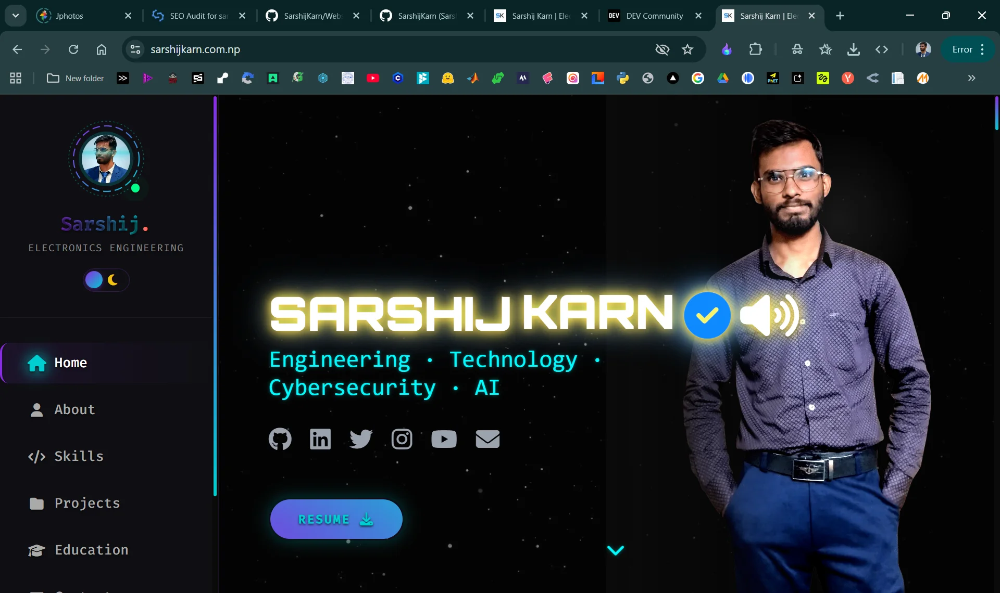

<div align="center">

# 🚀 NEURAL-AURA PORTFOLIO

[](https://sarshijkarn.com.np)
[](https://vercel.com)
[](https://pages.github.com/)



### ⚡ _Engineering · Technology · Cybersecurity · AI_

**A futuristic, high-performance portfolio showcasing the intersection of electronics engineering and cutting-edge technology.**

[🌐 Live Demo](https://sarshijkarn.com.np) · [📧 Contact](mailto:sarshijkarn333@gmail.com) · [💼 LinkedIn](https://www.linkedin.com/in/sarshij-karn-1a7766236/)

</div>

---

## ✨ Features

🎨 **Cyberpunk Aesthetic**

🚄 **Performance Optimized**

📱 **Fully Responsive**

🎭 **Advanced Animations**

📬 **Instant Contact Form**

---

## 🛠️ Tech Stack

### **Frontend**


**Libraries & Frameworks:**

- [GSAP](https://greensock.com/gsap/) - Professional-grade animations
- [Font Awesome](https://fontawesome.com/) - Icon library
- Custom CSS Variables & Glassmorphism

### **Backend**


**Services:**

- **Vercel Serverless Functions** - Instant backend
- **Resend API** - Email delivery
- **Discord Webhooks** - Real-time notifications

### **Deployment**


- **Frontend**: GitHub Pages
- **Backend**: Vercel Edge Network
- **DNS**: Cloudflare

---

## 📂 Project Structure

```
My-Website/
├── 📄 index.html              # Main HTML structure
├── 🎨 style.css               # Global styles & animations
├── 📜 script.js               # GSAP animations & logic
├── 🎭 project-icons.css       # Project showcase styling
│
├── 🔌 api/
│   └── contact.js             # Vercel serverless contact handler
│
├── ⚙️ vercel.json              # Vercel configuration
├── 📦 package.json            # Dependencies
├── 🔐 .htaccess               # Cache & security headers
├── 🤫 .gitignore              # Git ignore rules
│
├── 📂 assets/
│   ├── 🖼️ img/                # Profile images & icons
│   │   ├── fullME.webp       # Hero portrait
│   │   ├── cyber-portrait.webp
│   │   └── web-preview.webp  # README preview
│   └── 🎥 videos/             # Background loops
│       └── galaxy.mp4
│
└── 📄 README.md               # This file!
```

---

## 🚀 Quick Start

### Prerequisites

- Modern web browser
- Git installed
- (Optional) Node.js for local development

### Installation

```bash
# Clone the repository
git clone https://github.com/SarshijKarn/My-Website.git

# Navigate to directory
cd My-Website

# Install Dependencies (required for Tailwind CSS)
npm install

# Build CSS (if making style changes)
npm run build:css

# Open in browser
# Simply open index.html in your browser
# OR use a local server (recommended):

# Using Python
python -m http.server 8000

# Using Node.js
npx http-server

# Using VS Code Live Server
# Install "Live Server" extension and click "Go Live"
```

Visit `http://localhost:8000` (or your server port)

---

## ⚙️ Configuration

### Backend Setup (Optional - for Contact Form)

The contact form uses Vercel Serverless Functions. To set up:

1. **Deploy to Vercel**:

   ```bash
   npm install -g vercel
   vercel
   ```

2. **Add Environment Variables** in Vercel dashboard:

   - `EMAIL_USER` - Your sending email
   - `EMAIL_PASS` - Resend API key
   - `ADMIN_EMAIL` - Recipient email
   - `DISCORD_WEBHOOK_URL` - Discord webhook (optional)

3. **Configure DNS**:
   - Add SPF record: `v=spf1 include:_spf.resend.com ~all`
   - Add DKIM/DMARC records from Resend

See [deployment guide](# "Check Vercel documentation") for detailed instructions.

---

## 👨‍💻 About the Developer

<div align="center">

### **SARSHIJ KARN**

**Electronics, Communication & Information Engineering | AI Enthusiast | Cybersecurity Explorer**

[](https://sarshijkarn.com.np)
[](https://www.linkedin.com/in/sarshij-karn-1a7766236/)
[](mailto:sarshijkarn333@gmail.com)
[](https://github.com/SarshijKarn)

📍 **Location**: Nepal  
🎓 **Institution**: Tribhuvan University  
💼 **Focus**: Electronics · AI · Cybersecurity · Web Development

</div>

---

## 📊 Project Stats


---

<div align="center">

### ⭐ Star this repo if you like it!

**Made with ❤️ and ☕, built by SARSHIJ KARN**

_Building the future_ 🚀

[⬆ Back to Top](#-neural-aura-portfolio)

</div>
